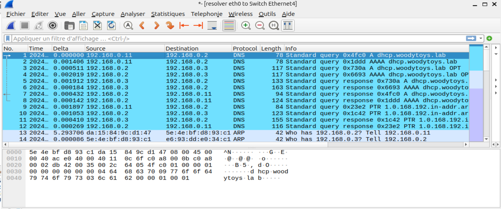
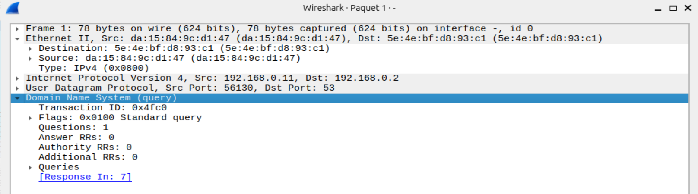
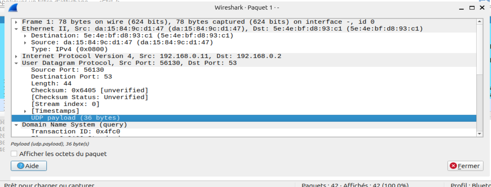
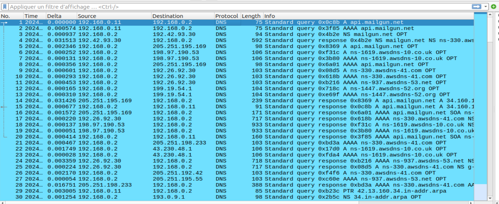
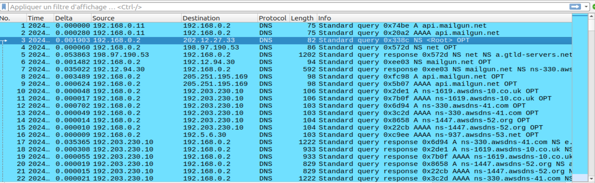
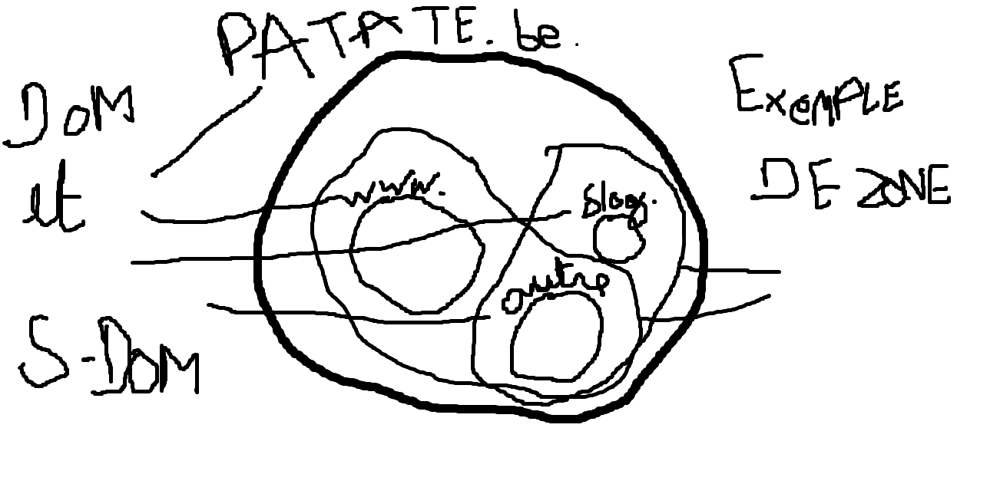

# Analyse de la Résolution DHCP pour `dhcp.woodytoys.lab`

**Clarembaux Robin**  
**L2**  
**19/12/24**

## Analyse de la résolution DHCP pour `dhcp.woodytoys.lab` depuis le poste du directeur (sniffer entre le switch et le resolver)

### Checklist

*Pour chaque AA : l'analyse explique les étapes de l'échange identifié*

1. **Poste du directeur → Résolveur** : demande le RR A pour l'IPv4 correspondant
2. **Poste du directeur → Résolveur** : demande le RR AAAA pour l'IPv6 correspondant

3. **Résolveur → SOA** : demande le RR A pour l'IPv4 correspondant
4. **Résolveur → SOA** : demande le RR AAAA pour l'IPv6 correspondant

5. **SOA → Résolveur** : fournit le RR A pour l'IPv4 correspondant
6. **SOA → Résolveur** : fournit le RR AAAA pour l'IPv6 correspondant

7. **Résolveur → Poste du directeur** : fournit le RR A pour l'IPv4 correspondant
8. **Résolveur → Poste du directeur** : fournit le RR AAAA pour l'IPv6 correspondant (redirige vers l'IPv4)

9. **Poste du directeur → Résolveur** : demande le RR PTR pour le nom correspondant à l'IP reçue

10. **Résolveur → SOA** : demande le RR PTR pour le nom correspondant à l'IP reçue

11. **SOA → Résolveur** : fournit le RR PTR pour le nom correspondant

12. **Résolveur → Poste du directeur** : fournit le RR PTR reçu par le résolveur pour le nom correspondant

### Rôles des Machines Intervenant dans l'Échange

1. **Poste du directeur (192.168.0.11)**
   - **Rôle** : Client DNS
   - **Fonctions** :
     - Envoie une requête DNS pour résoudre un nom de domaine en adresse IP (RR A ou AAAA).
     - Envoie une requête DNS inverse (PTR) pour obtenir le nom de domaine associé à une adresse IP.

2. **Résolveur DNS (192.168.0.2)**
   - **Rôle** : Serveur DNS intermédiaire
   - **Fonctions** :
     - Reçoit les requêtes du client (directeur).
     - Interroge le serveur autoritaire (SOA) pour obtenir les enregistrements demandés.
     - Retourne les réponses au client.

3. **SOA (192.168.0.3)**
   - **Rôle** : Serveur DNS autoritaire
   - **Fonctions** :
     - Gère la zone DNS de `woodytoys.lab`.
     - Fournit les enregistrements RR A (IPv4), RR AAAA (IPv6) ou RR PTR (résolution inversée) demandés par le résolveur.

### Champs d'En-tête du Protocole DNS

1. **Transaction ID**
   - **Champ** : `Transaction ID: 0x4fc0`
   - **Description** :
     - Identifiant unique pour associer une requête et sa réponse.
     - Dans cette trame, le Transaction ID est `0x4fc0`, et il sera repris dans la réponse correspondante pour permettre au client de faire le lien.

2. **Flags**
   - **Champ** : `Flags: 0x0100 Standard query`
   - **Description** :
     - Indique qu'il s'agit d'une requête standard.
     - Les bits importants ici sont :
       - **QR (Query/Response)** : 0 (indique que c'est une requête).
       - **OPCODE** : 0 (Requête standard).
       - **RD (Recursion Desired)** : 1 (demande une résolution récursive).

3. **Questions**
   - **Champ** : `Questions: 1`
   - **Description** :
     - Indique qu'une seule requête DNS est incluse dans ce paquet.
     - Cela correspond au domaine demandé dans la section Queries.

4. **Answer RRs**
   - **Champ** : `Answer RRs: 0`
   - **Description** :
     - Indique qu'il n'y a pas de réponse incluse dans ce paquet.
     - Normal, car c'est une requête DNS, pas une réponse.

5. **Authority RRs**
   - **Champ** : `Authority RRs: 0`
   - **Description** :
     - Indique qu'aucun enregistrement d'autorité n'est inclus.
     - Typique pour une requête standard.

6. **Additional RRs**
   - **Champ** : `Additional RRs: 0`
   - **Description** :
     - Indique qu'il n'y a pas d'enregistrements supplémentaires (comme EDNS).
     - Montre que la requête est simple, sans options avancées.

7. **Queries**
   - **Champ** : `Queries`
   - **Description** :
     - Contient les informations spécifiques sur ce qui est demandé dans la requête, RR demandé, type, etc.

### Protocole de Transport Utilisé

- **Protocole** : UDP
- **Ports** :
  - **Port source** : 56130
    - Port aléatoire choisi par le poste client (192.168.0.11).
    - Sert à identifier cette session spécifique et à recevoir la réponse.
  - **Port destination** : 53
    - Port standard pour le service DNS.
    - Les serveurs DNS écoutent sur ce port pour traiter les requêtes entrantes.

#### Pourquoi UDP est utilisé ?

- **Faible surcharge** :
  - UDP est un protocole sans connexion, réduisant la surcharge réseau.
  - Important pour les requêtes rapides comme DNS.
- **Vitesse** :
  - DNS privilégie la rapidité pour résoudre les noms de domaine.
  - UDP est plus rapide que TCP car il n'y a pas de mécanismes de retransmission ou d'acquittement.
- **Simplicité** :
  - Une seule requête et une seule réponse suffisent dans la majorité des cas DNS, correspondant parfaitement au fonctionnement d'UDP.

### Trace de Requêtes Itératives du Résolveur

L'étudiant montre une trace où un résolveur effectue des requêtes itératives sur Internet depuis le haut de la hiérarchie jusqu'au NS cible. Il nomme et explique chaque niveau DNS exploré en faisant référence à la trace.

**mailgun.net** :

- J'ai dû chercher un nom de domaine exotique sinon le DNS était trop vite résolu et j'ai aussi purgé le cache sinon il ne prenait pas le root server.
- Du coup, j'ai vidé le cache avec `rndc flush`.
- Je suis donc parti sur `api.mailgun.net`.

**Requête A et AAAA pour `api.mailgun.net`**

1. **Client → Résolveur local**
   - **Paquets** : 1 et 2
   - **Action** :
     - Le client (192.168.0.11) envoie une requête au résolveur DNS local (192.168.0.2).
     - Il demande les enregistrements A (adresse IPv4) et AAAA (adresse IPv6) pour `api.mailgun.net`.
   - **Explication** :
     - Le client ne sait pas où chercher dans la hiérarchie DNS, donc il délègue cette tâche au résolveur local.

2. **Résolveur → Serveur Root**
   - **Paquet** : 3
   - **Action** :
     - Le résolveur local interroge un serveur root (202.12.27.33) pour obtenir les serveurs NS du TLD `.net`.
   - **Explication** :
     - Les serveurs root sont le premier niveau de la hiérarchie DNS. Ils ne connaissent pas directement `api.mailgun.net`, mais ils savent quels serveurs gèrent le TLD `.net`.

3. **Root → Résolveur**
   - **Paquet** : 4
   - **Action** :
     - Le serveur root répond avec les adresses des serveurs NS responsables du TLD `.net` (ex. `a.gtld-servers.net`).
   - **Explication** :
     - Le serveur root redirige le résolveur vers les serveurs gérant le domaine de premier niveau `.net`.

4. **Résolveur → Serveur TLD (.net)**
   - **Paquet** : 5
   - **Action** :
     - Le résolveur interroge un serveur TLD (198.97.190.53) pour obtenir les serveurs NS responsables de `mailgun.net`.
   - **Explication** :
     - Le TLD `.net` est le deuxième niveau de la hiérarchie DNS. Il ne connaît pas les détails de `api.mailgun.net`, mais il sait quels serveurs autoritaires gèrent `mailgun.net`.

5. **TLD → Résolveur**
   - **Paquet** : 6
   - **Action** :
     - Le serveur TLD retourne les serveurs NS pour `mailgun.net` (ex. `ns-330.awsdns-41.com`).
   - **Explication** :
     - Le serveur TLD dirige le résolveur vers les serveurs autoritaires responsables du domaine `mailgun.net`.

6. **Résolveur → Serveur Autoritaire (`mailgun.net`)**
   - **Paquets** : 7 et suivants
   - **Action** :
     - Le résolveur interroge les serveurs autoritaires pour `mailgun.net` (ex. 205.251.195.169) pour obtenir les enregistrements A et AAAA de `api.mailgun.net`.
   - **Explication** :
     - Les serveurs autoritaires ont les informations finales pour `api.mailgun.net`, y compris son adresse IP.

7. **Serveur Autoritaire → Résolveur**
   - **Paquets** : Plusieurs réponses (paquets 10 à 22)
   - **Action** :
     - Les serveurs autoritaires retournent les enregistrements A (IPv4) et AAAA (IPv6) pour `api.mailgun.net`.
   - **Explication** :
     - Les adresses IP finales (par exemple, `34.160.111.145`) sont renvoyées au résolveur pour être transmises au client.

### Différence entre Zone et Domaine

- **Domaine** :
  - Ensemble de l'ensemble du territoire et des sous-domaines.
- **Zone** :
  - Espaces configurables indépendamment à plusieurs niveaux.
  
**Importance** :
- Permet de configurer les zones de manière à assigner chaque zone à un name server selon la configuration souhaitée.
- Facilite la répartition de la charge des serveurs DNS.

### Types de Resource Records dans la Trace

1. **Enregistrement A**
   - Associe un nom de domaine à une adresse IPv4.

2. **Enregistrement AAAA**
   - Associe un nom de domaine à une adresse IPv6.

3. **NS (Name Server)**
   - Indique quels serveurs sont responsables d'une zone spécifique.

4. **Enregistrement SOA (Start of Authority)**
   - Contient des informations sur la zone, telles que le serveur DNS principal, l'administrateur de la zone, et des paramètres de mise à jour.

